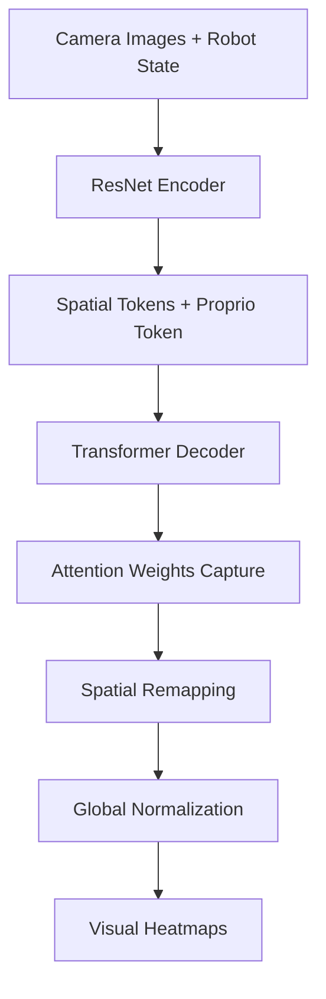

# Physical AI Interpretability

🤖 **Interpretability tools for transformer-based Physical AI and robotics models.**

Understand where your robot "looks" during complex manipulation tasks by visualizing transformer attention patterns with industrial-grade robustness.

## ✨ Features

- 🎯 **Attention Visualization**: Real-time heatmaps showing where the robot focuses
- 🧠 **Cross-Modal Analysis**: Unified visualization of visual + proprioceptive attention  
- 🛡️ **Production Ready**: Robust error handling, edge case management, device compatibility
- 📊 **SAE Integration**: Sparse autoencoder feature extraction for interpretability
- 🔧 **Easy Integration**: Drop-in wrapper for LeRobot ACT policies

## 🎬 Attention Maps


### How It Works



**What you see:**
- 🔴 **Red/Yellow**: High attention zones (where robot "looks")
- 🔵 **Blue/Green**: Low attention areas
- 🟣 **Magenta Border**: Proprioceptive attention intensity
- ✨ **Brightness**: Attention strength

### Technical Improvements (v2.0)

**🔧 Critical Bug Fixes:**
- **Robust Attention Shape Handling**: Automatic detection of head dimensions across PyTorch implementations
- **Correct Token Indexing**: Validated mapping prevents misaligned attention visualization
- **Edge Case Normalization**: Preserves information even with uniform attention patterns

**🚀 Enhanced Features:**
- **Global Cross-Modal Normalization**: Visual and proprioceptive attention normalized together
- **Device/Dtype Safety**: Automatic handling of CUDA/CPU and dtype mismatches  
- **Comprehensive Validation**: Input validation with informative error messages
- **Fallback Systems**: Graceful degradation when components fail

## 🚀 Quick Start

### Installation

```bash
# Clone repository
git clone https://github.com/villekuosmanen/physical-AI-attention-mapper
cd physical-AI-attention-mapper

# Create virtual environment and install dependencies
uv venv
source .venv/bin/activate
uv pip install -r requirements.txt

# Set environment variables
cp .envrc.example .envrc
# Edit .envrc with your paths and settings
source .envrc
```

### Analyze Existing Dataset

Run post-hoc attention analysis on existing episodes:

```bash
python examples/visualise_original_data_attention.py \
    --dataset-repo-id lerobot/svla_so101_pickplace \
    --episode-id 29 \
    --policy-path ../lerobot/outputs/train/act_johns_arm/checkpoints/last/pretrained_model \
    --output-dir ./analysis_output
```

**Environment Setup:**
```bash
# If you get ModuleNotFoundError, set PYTHONPATH:
export PYTHONPATH="/path/to/physical-AI-attention-mapper:$PYTHONPATH"
```

### Real-time Integration

**Drop-in Wrapper for LeRobot ACT:**

```python
from src.attention_maps import ACTPolicyWithAttention
from lerobot.common.policies.factory import make_policy

# Load your ACT policy
policy = make_policy(policy_cfg, ds_meta=dataset.meta)

# Wrap with attention capabilities
policy_with_attention = ACTPolicyWithAttention(policy)

# During inference
observation = robot.capture_observation()
action, attention_maps = policy_with_attention.select_action(observation)

# Visualize attention
visualizations = policy_with_attention.visualize_attention(
    attention_maps=attention_maps, 
    observation=observation,
    use_rgb=True,
    overlay_alpha=0.6
)

# Send action to robot
robot.send_action(action)
```

**LeRobot Compatibility:**

For smooth video visualization, modify LeRobot's ACT policy to run inference at every timestep:

```python
# In lerobot/common/policies/act/modeling_act.py
class ACTPolicy(PreTrainedPolicy):
    @torch.no_grad
    def select_action(self, batch: dict[str, Tensor], force_model_run: bool = False):
        # ... existing code ...
        
        if len(self._action_queue) == 0:
            # ... existing inference code ...
        elif force_model_run:
            # Run inference for attention capture (results discarded)
            _ = self.model(batch)
            
        return self._action_queue.popleft()
```

**Supported Policies:**
- ✅ **ACT (Action Chunking Transformer)**: Full support with attention visualization
- 🔄 **Pi0 & VLA models**: Planned for future releases 

## 🧬 Feature Extraction (SAE)

**Sparse Autoencoder Integration** for discovering interpretable features in robot behavior patterns.

Based on [Dictionary Learning](https://transformer-circuits.pub/2023/monosemantic-features) from Anthropic's research (similar to [Golden Gate Claude](https://www.anthropic.com/news/golden-gate-claude)).

🎯 **[Live Demo on Hugging Face Spaces](https://huggingface.co/spaces/villekuosmanen/act-feature-visualiser)**

### SAE Training Pipeline

```bash
# 1. Train compact ACT model (for consumer GPUs)
# Set dim_model=124 in LeRobot config

# 2. Train sparse autoencoder  
python scripts/train_sae.py \
    --num_tokens 75 \
    --feature_dim 4096 \
    --l1_penalty 0.1

# 3. Record feature activations
python scripts/record_feature_activations.py \
    --dataset_path ./data \
    --sae_path ./sae_model.pt

# 4. Analyze features
jupyter notebook scripts/analyse_features.ipynb

# 5. Launch interactive viewer
python examples/features_huggingface_space/ui.py
```

**Token Calculation:**
```python
# For images (480×640) with ResNet patches (32×32):
total_tokens = 2 + Σ(width/32 × height/32)
# Example: 2 + 2×((480/32) × (640/32)) = 602 tokens
# With sampling ratio 8: num_tokens = 600/8 = 75
```

### Enhanced SAE Features

- **🎯 Robust Token Sampling**: Multiple strategies (uniform, stride, block-average)
- **💾 Memory-Efficient Caching**: Safetensors with automatic memory management  
- **🔧 bfloat16 Support**: Optimized for modern hardware
- **📊 Real-time Monitoring**: Built-in metrics and logging with Loguru

## 🛠️ Development

### Code Quality
- **Linting**: Configured with Ruff for modern Python standards
- **Type Safety**: Full type annotations with modern syntax  
- **Testing**: Comprehensive error handling and edge cases
- **Logging**: Structured logging with Loguru

### Environment Configuration
```bash
# Use provided environment template
cp .envrc.example .envrc
# Edit with your settings:
# - Model paths
# - Dataset locations  
# - GPU/CPU preferences
# - Memory limits
```

## 🌟 Related Projects

- **[Pikodata](https://github.com/villekuosmanen/pikodata)**: Data Studio for LeRobot datasets with editing capabilities
- **[LeRobot](https://github.com/huggingface/lerobot)**: End-to-end robotics learning framework

## 🙏 Contributing

We welcome contributions! This project provides a solid foundation for robotics interpretability research.

**Priority areas:**
- Additional policy support (Pi0, VLA models)
- Performance optimizations
- New visualization techniques
- Documentation and examples

If you find this work valuable, consider [sponsoring the original author](https://github.com/sponsors/villekuosmanen)!
